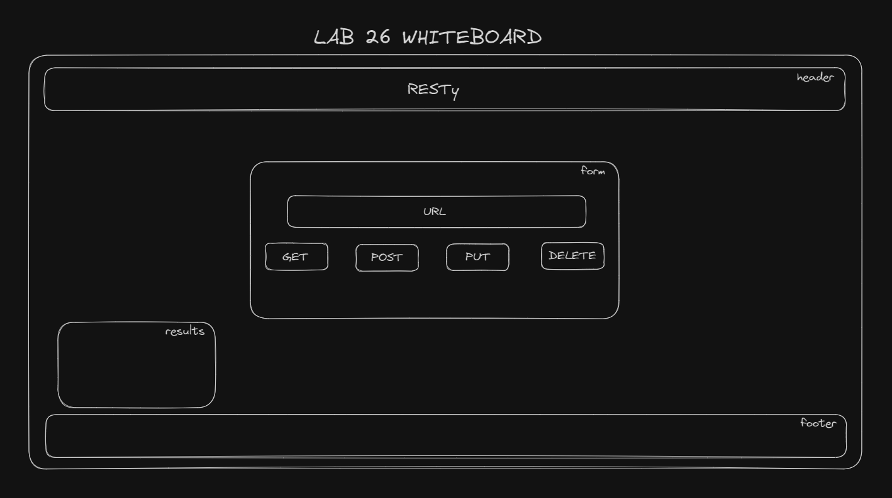

# LAB - Class 26

## Project: RESTy

### Author: Ryan Eastman

### Problem Domain

- **Lab 26 - RESTy:** Create a RESTy application which will peform RESTful API calls to remote APIs. Today, we begin the first of a 4-Phase build of the RESTy application, written in React. In this first phase, our goal is to setup the basic scaffolding of the application, with intent being to add more functionality to the system as we go. This initial build sets up the file structure so that we can progressively build this application in a scalable manner.

### Links and Resources

- [GitHub Actions ci/cd](https://github.com/DocHolliday13x/resty/actions/)
<!-- - [back-end server url](http://xyz.com) (when applicable)
- [front-end application](http://xyz.com) (when applicable) -->

### Collaborators

- Ryan Gallaway
- Reece Renninger

### Setup

- **Lab 26 - RESTy**

1. Create a react app named resty w/ `npx create-react-app resty`
2. Create a new repository on GitHub for this project
3. Push your initial commit to GitHub
4. Set up your folder structure
5. Create a `README.md` file with an overview of your project and notes about your lab
6. Create a pull request from the resty branch to your main branch
7. In Canvas, submit a link to your pull request
8. On GitHub, submit a link to your deployed application to the main branch of your repository
9. After initial setup is complete and proof of life is established, begin work on the lab requirements.
10. Convert all child components of `<App />` from classes to functions.
11. The `<App />` component serves as the container for all sub-components of this application.
12. Leave this component as a Class.
13. Make sure all base styles for `<App />` are included in a .scss imported within the App.jsx file.
14. Ensure that the `<Header />`, `<Footer />`, `<Results />` and `<Form />` components are imported using ES6 import syntax.
15. Use .scss files to style each component.
16. Each of the components use their own .scss file for styling.
17. Core application functionality should remain unchanged.
18. The `<Form />` component should:
19. Call a function `onSubmit()` that updates the `<App />` component via a function sent down as a prop so that the app can process the form values.
20. The `<Results />` component should show mock API results.

#### `.env` requirements (where applicable)

For now I have none and do not require one.

#### How to initialize/run your application (where applicable)

- Initialize applicaton with `npm start`

#### How to use your library (where applicable)

#### Features / Routes

- Feature One: Details of feature
- GET : `/hello` - specific route to hit

#### Tests

- How do you run tests?
- Any tests of note?
- Describe any tests that you did not complete, skipped, etc

- **Lab 26 Tests:** Tests are not required for this lab, but are a stretch goal.

#### UML

- 
